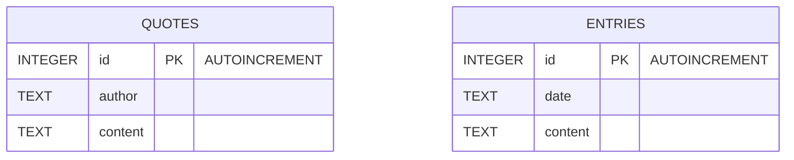

# Diagrama E-R

Modelul actual folosește două baze SQLite separate:
- `quotes.db` cu tabela `quotes`
- `journal.db` cu tabela `entries`

Nu există relații (foreign keys) între cele două tabele în implementarea curentă.

